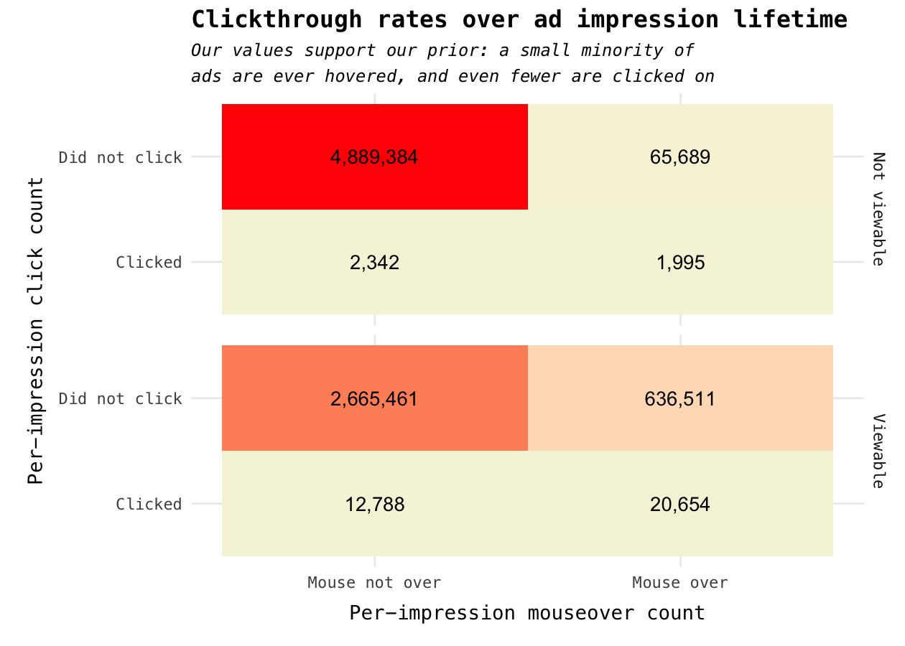
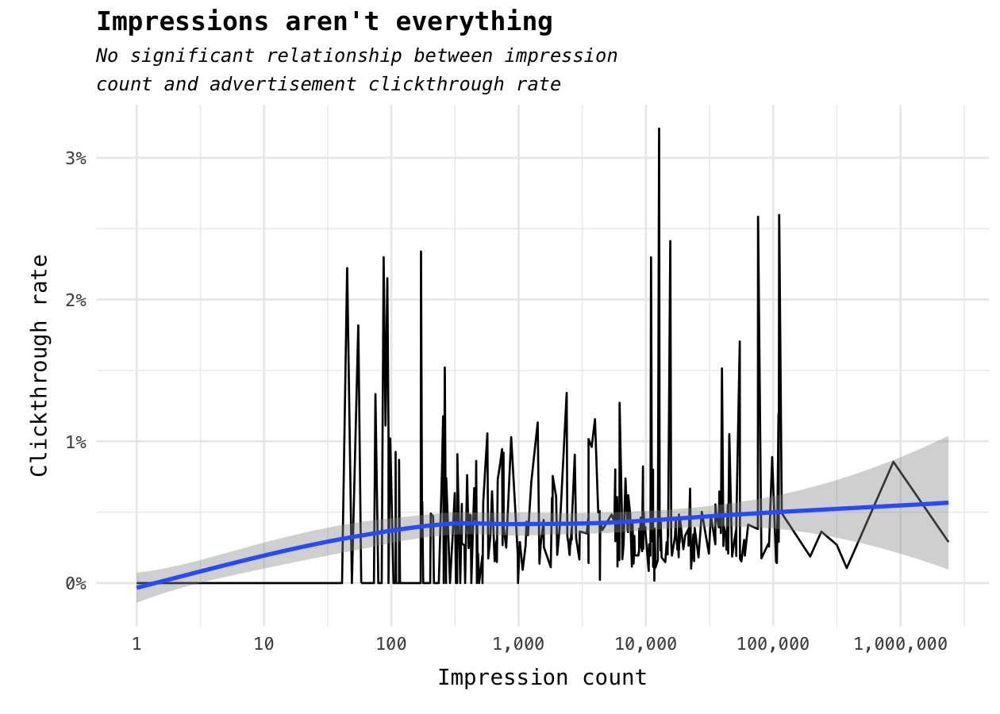
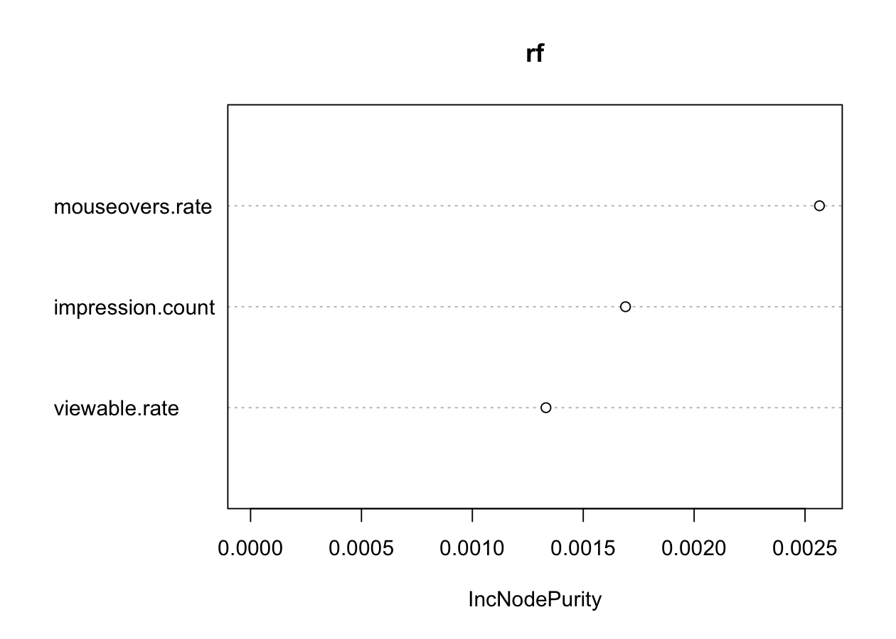

To the team at Triplelift,

Hi! My name is Danny Vilela and this is my submission for your data challenge. I approached the exploration of the dataset and communication of my code in the form resembling the other exploratory data analysis posts on my website --- it's my most comfortable data analysis form, and I hope it helps explain my thought process! Without further ado, let's dive into the dataset with the goal of **developing a model that's able to predict clickthrough rates**.

------------------------------------------------------------------------

Setup
=====

``` r
# Some behind-the-curtains setup
library(knitr)
library(randomForest)
library(scales)
library(ggthemes)
library(tidyverse)
library(lubridate)
library(caret)
library(dummies)
library(data.table)

knitr::opts_chunk$set(
  cache = TRUE, 
  warning = FALSE, 
  message = FALSE, 
  dpi = 180,
  comment = "#>",
  collapse = TRUE
)

options(width = 75)

theme_set(theme_minimal(base_family = "Menlo") +
            theme(plot.title=element_text(family = "Menlo")))
```

Pre-processing
==============

To start off, I immediately noticed I was dealing with a fairly sizable dataset: approximately half a gigabyte spread across 8 files (*code-test0000\_part\_00*, ..., *code-test0007\_part\_00*). Furthermore, I quickly noticed the files were not comma-delimited but pipe-delimited ("|" separating each observation field).

To make the analysis more tractable, I opted to join the files into one master file. I first manually inserted the header names into the master file *master.csv* -- there are likely better ways to do so with *sed*, but for a fairly low-dimensional dataset I thought it would be too much of a time sink.

Once I had the pipe-separated header in *master.csv*, I joined all files into *master.csv* like so:

``` bash
# With files in the local directory
for file in code-test*; do cat $file >> master.csv; done
```

This gives us a 450 MB file containing all records. Neat! This is actually pushing *dplyr* -- my go-to for analysis in R -- to its limits. *data.table* does a much better job working with larger data sets, so I'll weave between the two whenever necessary. Check the comments for a more thorough explanation, if necessary!

Exploratory data analysis
=========================

Next is the start of the analysis. To read the large data file readr usually suffices but *data.table*'s *fread* is my go-to for larger (250 MB+) files.

``` r
# Read in our data
data <- data.table::fread("../data-code-test/master.csv", sep = "|")

# NOTE: The instructions say to ignore the `is_adserver` column.
data[, is_adserver := NULL]
```

To know what I was working with, I usually look at the head

``` r
# Get the head of our dataset
data %>% head
#>              timestamp placement_id browser_id os_id region country
#> 1: 2015-10-25 00:00:00         4729         16     2     CA      US
#> 2: 2015-10-25 00:00:00         6427          4     5     MD      US
#> 3: 2015-10-25 00:00:00         5864          3     3     NY      US
#> 4: 2015-10-25 00:00:00          572         13     2     MO      US
#> 5: 2015-10-25 00:00:00         6245          3     2     FL      US
#> 6: 2015-10-25 00:00:00         4729         13     2     KS      US
#>    campaign creative_asset_id mouseovers clicks max_duration video_length
#> 1:   326815             16640          1      0           NA           NA
#> 2:   328135             13492          0      0           NA           NA
#> 3:   327947             12450          0      0           NA           NA
#> 4:   326815             16640          0      0           NA           NA
#> 5:   327703             13366          0      0           NA           NA
#> 6:   326815             16639          0      0           NA           NA
#>    viewable
#> 1:        1
#> 2:        1
#> 3:        0
#> 4:        1
#> 5:        0
#> 6:        1
```

and tail

``` r
# Get the tail, too.
data %>% tail
#>              timestamp placement_id browser_id os_id region country
#> 1: 2015-10-25 23:59:59         1631          4     5     PA      US
#> 2: 2015-10-25 23:59:59          572         13     2     NC      US
#> 3: 2015-10-25 23:59:59         5997          4     8     LA      US
#> 4: 2015-10-25 23:59:59         4729         12     2     MI      US
#> 5: 2015-10-25 23:59:59         3706          4     5     NV      US
#> 6: 2015-10-25 23:59:59         3507         13     2     MO      US
#>    campaign creative_asset_id mouseovers clicks max_duration video_length
#> 1:   328637              7358          0      0           NA           NA
#> 2:   326815             16642          0      0           NA           NA
#> 3:   328060             13863          0      0           NA           NA
#> 4:   326815             16642          0      0           NA           NA
#> 5:   326891             11422          0      0           NA           NA
#> 6:   328638              7367          0      0           NA           NA
#>    viewable
#> 1:        0
#> 2:        0
#> 3:        0
#> 4:        1
#> 5:        0
#> 6:        0
```

From the email's description of the fields I had a good feel for what each feature represented, but I didn't know how long the timestamp represented: is this data across a day, a week, a month? These could all complicate our prediction task to a great degree (mostly trend, cycles, seasonality).

``` r
# Grouping by timestamp, return count for each entry.
data[, .N, .(timestamp)] %>%
  slice(c(1:4, (n()-4):n()))
#>             timestamp   N
#> 1 2015-10-25 00:00:00 147
#> 2 2015-10-25 00:00:01 114
#> 3 2015-10-25 00:00:02  98
#> 4 2015-10-25 00:00:03 105
#> 5 2015-10-25 09:27:24  20
#> 6 2015-10-25 09:28:30  22
#> 7 2015-10-25 09:40:16  18
#> 8 2015-10-25 10:06:07  23
#> 9 2015-10-25 10:32:35  32
```

From both the head and tail and the above, we know that the data only spans one day: October 25th, 2015. Without *head* and *tail* we might have thought it ends at 10:32:35 just because the column is read as a character and not a datetime format, but luckily tail showed us otherwise. An easy solution to the above problem is to define the column type while reading in the file, but I'll do so below.

Next, I usually like taking a look at the summary of a dataset -- is there anything concerning or flat out misleading?

``` r
# Do some preprocessing to get our column format right.
# For all rows, change timestamp to POSIXct format,
# region and country to factors (not character).
data[, c("timestamp", "region", "country") := .(
  lubridate::ymd_hms(timestamp),
  as.factor(region),
  as.factor(country))
]
#>                    timestamp placement_id browser_id os_id region country
#>       1: 2015-10-25 00:00:00         4729         16     2     CA      US
#>       2: 2015-10-25 00:00:00         6427          4     5     MD      US
#>       3: 2015-10-25 00:00:00         5864          3     3     NY      US
#>       4: 2015-10-25 00:00:00          572         13     2     MO      US
#>       5: 2015-10-25 00:00:00         6245          3     2     FL      US
#>      ---                                                                 
#> 8294820: 2015-10-25 23:59:59          572         13     2     NC      US
#> 8294821: 2015-10-25 23:59:59         5997          4     8     LA      US
#> 8294822: 2015-10-25 23:59:59         4729         12     2     MI      US
#> 8294823: 2015-10-25 23:59:59         3706          4     5     NV      US
#> 8294824: 2015-10-25 23:59:59         3507         13     2     MO      US
#>          campaign creative_asset_id mouseovers clicks max_duration
#>       1:   326815             16640          1      0           NA
#>       2:   328135             13492          0      0           NA
#>       3:   327947             12450          0      0           NA
#>       4:   326815             16640          0      0           NA
#>       5:   327703             13366          0      0           NA
#>      ---                                                          
#> 8294820:   326815             16642          0      0           NA
#> 8294821:   328060             13863          0      0           NA
#> 8294822:   326815             16642          0      0           NA
#> 8294823:   326891             11422          0      0           NA
#> 8294824:   328638              7367          0      0           NA
#>          video_length viewable
#>       1:           NA        1
#>       2:           NA        1
#>       3:           NA        0
#>       4:           NA        1
#>       5:           NA        0
#>      ---                      
#> 8294820:           NA        0
#> 8294821:           NA        0
#> 8294822:           NA        1
#> 8294823:           NA        0
#> 8294824:           NA        0

# Summarize each column.
data %>% summary
#>    timestamp                    placement_id    browser_id    
#>  Min.   :2015-10-25 00:00:00   Min.   :  41   Min.   : 0.000  
#>  1st Qu.:2015-10-25 05:23:59   1st Qu.:4729   1st Qu.: 3.000  
#>  Median :2015-10-25 15:19:18   Median :4823   Median : 3.000  
#>  Mean   :2015-10-25 13:24:23   Mean   :4890   Mean   : 5.626  
#>  3rd Qu.:2015-10-25 19:55:25   3rd Qu.:5911   3rd Qu.:11.000  
#>  Max.   :2015-10-25 23:59:59   Max.   :6695   Max.   :16.000  
#>                                                               
#>      os_id            region           country           campaign     
#>  Min.   : 0.000   CA     : 872644   US     :8222705   Min.   :314215  
#>  1st Qu.: 2.000   TX     : 685030          :  33588   1st Qu.:326815  
#>  Median : 2.000   NY     : 576687   GB     :   9733   Median :327925  
#>  Mean   : 3.386   FL     : 452401   IN     :   8953   Mean   :327603  
#>  3rd Qu.: 5.000   PA     : 409903   CA     :   3694   3rd Qu.:328425  
#>  Max.   :10.000   (Other):5298153   (Other):  16107   Max.   :328846  
#>                   NA's   :      6   NA's   :     44                   
#>  creative_asset_id   mouseovers          clicks          max_duration    
#>  Min.   :  183     Min.   :0.00000   Min.   :0.000000   Min.   :     0   
#>  1st Qu.:13409     1st Qu.:0.00000   1st Qu.:0.000000   1st Qu.: 12198   
#>  Median :15226     Median :0.00000   Median :0.000000   Median : 31000   
#>  Mean   :14090     Mean   :0.08739   Mean   :0.004555   Mean   : 90502   
#>  3rd Qu.:16639     3rd Qu.:0.00000   3rd Qu.:0.000000   3rd Qu.:170419   
#>  Max.   :16672     Max.   :1.00000   Max.   :1.000000   Max.   :316000   
#>                                                         NA's   :8294655  
#>   video_length        viewable     
#>  Min.   : 16000    Min.   :0.0000  
#>  1st Qu.:264000    1st Qu.:0.0000  
#>  Median :280000    Median :0.0000  
#>  Mean   :227982    Mean   :0.4021  
#>  3rd Qu.:305000    3rd Qu.:1.0000  
#>  Max.   :316000    Max.   :1.0000  
#>  NA's   :8294655
```

A few of these have no reasonable interpretation -- the distribution of *os\_id* doesn't tell us much. However, from this summary we can see the following:

-   Yes, for sure, we only span one day.

-   Region seems to follow general population. This isn't anything new -- most analyses that have to do with people tend to center around high-population areas like California, New York, etc. -- but the relatively sharp cliff from CA to TX is worth noting.

-   The US is, by far, the largest nation reached by the day's advertisements. Again, not a big surprise (see above point), but the difference between the US and the next valid country, Great Britain, is very steep.

-   Mouseovers and clicks are long, long right tails. This is likely just the domain expectation -- if a user doesn't have AdBlock enabled seldom will they mouseover an advertisement, and an even smaller fraction will actually click on the ad.

-   There are large number of *NA* values in the *max\_duration* and *video\_length* columns -- what gives?! The most likely interpretation is that 8,294,655 impressions (remember: each record in this data set is an impression belonging to a campaign) were not videos.

-   Lastly, *viewable* seems to follow a similar, albeit more normal distribution relative to *mouseovers* and *clicks*. This may offer insight into the current proliferation of browser AdBlock extensions, and how advertisers can best anticipate and mitigate the effects of ad blockers.

Before honing in on our target variable -- (I assume) *clicks* -- we can do a bit more analysis on the dataset to get a feel of what we're working with. Intuitively, I'm interested at the interplay and distributions between *viewable*, *mouseovers*, and *clicks* -- what does the churn funnel look like across all campaigns on the 25th?

``` r
# Group all data into whether it was viewable,
# moused-over, and clicked. This gives us
# 2^3 different subgroup configurations.
impression.funnel <- data %>%
  select(viewable, mouseovers, clicks) %>%
  group_by(viewable, mouseovers, clicks) %>%
  summarize(count = n()) %>%
  ungroup() %>%
  mutate(viewable = ifelse(viewable == 1, "Viewable", "Not viewable"),
         mouseovers = ifelse(mouseovers == 1, "Mouse over", "Mouse not over"),
         clicks = ifelse(clicks == 1, "Clicked", "Did not click")) %>%
  mutate_at(.cols = vars(viewable, mouseovers, clicks),
            .funs = funs(as.factor))

# Plot our heatmap that'll show how click counts
# change across viewable vs non-viewable ads.
ggplot(data = impression.funnel,
       mapping = aes(x = mouseovers, y = clicks)) +
  geom_tile(mapping = aes(fill = count)) +
  scale_fill_gradient(low = "beige", high = "red", guide = "none") +
  geom_text(aes(label = count %>% comma)) +
  facet_grid(viewable ~ .) +
  labs(x = "Per-impression mouseover count", 
       y = "Per-impression click count",
       title = "Clickthrough rates over ad impression lifetime",
       subtitle = paste("Our values support our prior: a small minority of",
                        "ads are ever hovered, and even fewer are clicked on",
                        sep = "\n")) +
  theme(plot.title = element_text(face = "bold"),
        plot.subtitle = element_text(face = "italic", size = 9.5,
                                     lineheight = unit(1.25, "cm")),
        axis.title.x = element_text(margin = margin(t = 10, b = 7)),
        axis.title.y = element_text(margin = margin(l = 10, r = 7)))
```



As we might expect, a large portion of impressions are not viewable, hence the mouse cannot hover over the ad, and subsequently the ad cannot be (and was not) clicked. I'm most surprised by ads that are not viewable but are either: clicked (mouse over or not) or not clicked and mouse over -- how does that happen? It isn't the focus of this analysis but it may be worth looking into the instrumentation and data collection -- it may signal that the system that tracks whether an ad is viewable can use tuning, or perhaps how we record whether an ad is hovered or clicked on needs some work.

> Note: I'm not fully satisfied with the above plot. I can imagine ways in which to better communicate the viewable -&gt; hoverable -&gt; clicked funnel, but was unable to get it working how I envisioned. If I had a bit more time, I'd look into improving how the funnel is communicated for visual clarity.

From the above chart we can also see that the ratio between *did not click* to *clicked* across *viewable* and *not viewable* ads is very different: only 0.0875% of not viewable ads were clicked on, whereas 1.01% were (excluding mouse over or not over ad). This likely reinforces our intuition that visible ads -- those not blocked by AdBlock or other advertisement circumvention extensions -- are much more likely to be clicked on relative to non-visible ads.

Our next question is regarding campaign size: is there any significant correlation between a larger campaign (more impressions) and the number of clicks received? Note that in order to have data at the campaign resolution, we need to aggregate based on our campaign identifier, *campaign*.

``` r
# Determine clickthrough rate on a per-campaign resolution.
impressions.vs.clicks <-
  data %>%
  select(campaign, clicks) %>%
  group_by(campaign) %>%
  summarize(
    impression.count = n(),
    clickthrough.rate = (sum(clicks, na.rm = T) / impression.count)
  ) %>%
  ungroup()

# Plot campaign impression counts against clickthrough rate.
ggplot(data = impressions.vs.clicks,
       mapping = aes(x = impression.count, y = clickthrough.rate)) +
  geom_line() +
  scale_x_log10(labels = 10^(0:6) %>% comma, breaks = 10^(0:6)) +
  scale_y_continuous(labels = percent) +
  stat_smooth() +
  labs(x = "Impression count",
       y = "Clickthrough rate",
       title = "Impressions aren't everything",
       subtitle = paste("No significant relationship between impression",
                        "count and advertisement clickthrough rate", sep = "\n")) +
  theme(plot.title = element_text(face = "bold"),
        plot.subtitle = element_text(face = "italic", size = 9.5,
                                     lineheight = unit(1.25, "cm")),
        axis.title.x = element_text(margin = margin(t = 10, b = 7)),
        axis.title.y = element_text(margin = margin(l = 10, r = 7)))
```



For impression count, with every increase in an order of magnitude we can't really make strong statements on expected clickthrough rate. The data is incredibly noisy at the campaign level, and no clear trends emerge -- even with a smoothing effect applied onto the data, the overall pattern points to nearly zero difference in clickthrough rate between campaigns with 100 impressions versus campaigns with upwards of 100,000 impressions.

The *ever so slight* increase at the end may be worth investigating, but it's worth noting that the confidence intervals increase to reflect the lack of sample size and the high variance in clickthrough rate at large (&gt; 100,000) impressions.

``` r
# Quick check on what campaigns had above 100,000 impresssions.
impressions.vs.clicks %>%
  filter(impression.count > 1e5) %>%
  arrange(desc(clickthrough.rate)) %>%
  mutate(clickthrough.rate = clickthrough.rate %>% percent) %>%
  filter(row_number() == 1 | row_number() == n())
#> # A tibble: 2 × 3
#>   campaign impression.count clickthrough.rate
#>      <int>            <int>             <chr>
#> 1   326005           111317             2.60%
#> 2   328417           378062             0.11%
```

Again, nothing too telling: for campaigns with above 100,000 impressions, clickthrough rate can vary between 0.11% and 2.60%. This only reinforces our idea that impression count may not be the most telling metric on how well a campaign's clickthrough rate will be. Speaking of which, I almost forgot to answer the actual challenge! Let's build a model.

Predictive Modeling
===================

Now's as good of a time as ever to build our model for predicting clickthrough rates! I'm a big believer in starting off with a baseline model -- a model that may not be the most sophisticated or """sexy""", but that gets us to a standard worth improving upon.

To kick things off, I'll go with quite possibly the easiest prediction possible: the mean. We can use the mean of our target as an absolute baseline because unless we do something *seriously* wrong, we *cannot* do worse than this.

So, let's first split our dataset into our training and testing sets on a 70/30 split:

``` r
# First, group our data so we're looking at per-campaign clickthrough rate.
campaigns <- data %>%
  select(campaign, clicks) %>%
  group_by(campaign) %>%
  summarize(
    impression.count = n(),
    clickthrough.rate = (sum(clicks, na.rm = T) / impression.count)
  ) %>%
  ungroup(campaign)

# Set our random generation seed, requested sample size,
# and extract the indices we'd like in our training set.
set.seed(123)
sample_size <- floor(0.70 * nrow(campaigns))
train_indices <- sample(seq_len(nrow(campaigns)), size = sample_size)

# Isolate our training vs test data sets.
train <- campaigns[train_indices, ]
test <- campaigns[-train_indices, ]
```

then compute our baseline prediction heuristic (mean of our training data set's target feature). To evaluate how well this "prediction" accounts for the data set's variance, we can use the Root Mean Squared error, which is just the mean of the squared difference between the predicted and actual values,

``` r
# Determine mean we'll use to predict new values.
train.clickthrough.mean <- mean(campaigns$clickthAjrough.rate)

# Assign new column to test in order to compute MSE
test <- test %>%
  mutate(predicted.clickthrough.rate = train.clickthrough.mean)

# Compute MSE, then Root MSE, and output as MSE.
mean((test$predicted.clickthrough.rate - test$clickthrough.rate)^2, na.rm = TRUE) %>%
  sqrt %>%
  percent
#> [1] "NaN%"
```

That's...surprising! Interpreted, our most basic predictive model is able to achieve a Root Mean Squared Error of 0.004. This means our basic model can, on average, predict an accurate clickthrough rate for any given campaign to within 0.425% of its actual clickthrough rate -- this is actually within 1 standard deviation (0.46%) of the overall campaign clickthrough rate mean!

So, problem solved, right? Well, not quite. We would hope that a more sophisticated model would be able to make even better predictions on a campaign's clickthrough rate.

Next, I'll ratchet up the sophistication: let's see how a random forest model might fare! I'm reaching for a random forest for a few reasons:

-   it's fairly robust out-of-the-box parameters (its default parameters are usually *very* close to ideal)

-   it's able to handle outliers very well -- this data set didn't exhibit that many significant outliers, but we can imagine a more viral ad campaign quickly throwing off a more variant model like a decision tree

-   based on our above observation of (noisy) clickthrough rate, it seems like a basic decision tree's inherent variance might not fit our data so well -- an ensemble approach mitigates this variance and generally performs very well

> Note: I was a bit pressed for time, so I didn't have much time to really evaluate a model just above using the training data's mean. If I had an extra day or two, I would have iterated on the model like so: mean -&gt; decision tree -&gt; random forest. I also took at RuleFit which seems like a *very* promising model, although I would need more time to really understand its heuristics. Back to the modeling!

I'll start by properly dividing our source data set in order to include the numerous categorical features that were left out for the basic model:

``` r
# categoricals <- c("browser_id", "os_id", "region", "country")
# 
# data.dummy <- dummy.data.frame(data %>% slice(1: 10000), names = categoricals, sep = "_")
# 
# by.campaign.encoded <- data.dummy %>%
#   group_by(campaign) %>%
#   summarize_at(.cols = vars(matches("browser_id_*"), matches("os_id_*"),
#                             matches("region_*"), matches("country_*")),
#                .funs = funs(relative.count(field = ., total = n())))
# 
# by.campaign.master <- data.dummy %>%
#   group_by(campaign) %>%
#   summarize(
#     impression.count = n(),
#     viewable.rate = relative.count(viewable, impression.count),
#     mouseovers.rate = relative.count(mouseovers, impression.count),
#     clickthrough.rate = relative.count(clicks, impression.count)
#   ) %>%
#   cbind(by.campaign.encoded)

# Quick function definition for computing rates
relative.count <- function(field, total) (sum(field, na.rm = T) / total)

# Get per-campaign aggregate data on impressions, viewable rate, mouseover rate,
# and our taret clickthrough rate.
campaigns <- data %>%
  group_by(campaign) %>%
  summarize(
    impression.count = n(),
    viewable.rate = relative.count(viewable, impression.count),
    mouseovers.rate = relative.count(mouseovers, impression.count),
    clickthrough.rate = relative.count(clicks, impression.count)
    # amount.of.video.completed = median(max_duration / video_length),
    # video_length = relative.count(video_length, impression.count)
  )

# Likewise, set our random number's seed, isolate training indices, etc.
set.seed(123)
sample_size <- floor(0.70 * nrow(campaigns))
train_indices <- sample(seq_len(nrow(campaigns)), size = sample_size)

# Isolate training and test sets.
train <- campaigns[train_indices, ]
test <- campaigns[-train_indices, ]
```

Unfortunately, I've left a large part of the above code commented. When building predictive models, we usually want to encode categorical values (like *region*) that can take up to *k* values (like *NY*, *CA*, etc.) into *k* − 1 binary features. There's a ton of great reading on whether it's important to encode categoricals, and while performing this analysis I read [Kuhn's](http://appliedpredictivemodeling.com/blog/2013/10/23/the-basics-of-encoding-categorical-data-for-predictive-models) interpretation.

Why'd I leave it out? Not because I was too rushed -- the code is there! -- but because of technical limitations. R works by loading data into memory, and even my 16 GB memory Macbook Pro isn't able to handle the data explosion caused by creating all those columns from only four categoricals: *browser\_id*, *os\_id*, *region*, and *country*.

This is problematic -- if each record is an impression, how do we group them into campaigns and deal with the categorical columns? As far as I'm aware, there's no reasonable way to "average" or "choose" between numerous categorical values, so for now I'd rather drop those columns from our analysis at the risk of lower predictive strength. In a production setting, we would obviously rather keep as much data as possible and invest in better infrastructure.

Likewise, I also left out the ratio between max duration and video length due to sparse records -- a large majority of impressions are not videos and thus any valid values would be extremely subject to even slight variance.

Now that we've split our data into training and test sets, we can build our forest regressor model. Note that we're building our model on *clickthrough.rate*, which is a double and so our random forest will default to a regression problem and not a classification problem.

``` r
# Signal what features we would like evaluated as part of our random forest.
cols <- c("impression.count", "viewable.rate", "mouseovers.rate", "clickthrough.rate")

# Build our random forest!
rf = randomForest(clickthrough.rate ~ ., data = train[, cols], keep.forest = TRUE)

# Output the statistics and outcomes associated with random forest regression.
rf
#> 
#> Call:
#>  randomForest(formula = clickthrough.rate ~ ., data = train[,      cols], keep.forest = TRUE) 
#>                Type of random forest: regression
#>                      Number of trees: 500
#> No. of variables tried at each split: 1
#> 
#>           Mean of squared residuals: 1.370001e-05
#>                     % Var explained: 38.72
```

About time! We see that the the forest's root mean squared error is 0.373% -- lower than assuming the mean is the best estimation of our outcome! *Phew*. That said, the interpretability of our model has been compromised considerably: using only the columns defined in *cols*, we don't get any input from the region, country, etc. features that we dropped earlier. A shame, because we're effectively sure that including more features will never hurt the performance of a machine learning model.

Now that we have an improved model, how can we derive business insights from it? Well, we can check variable importance, which gives us a relative understanding of what variables are most influential over our model's prediction for clickthrough rate.

``` r
# Plot variable importance plot.
# I'm foreign to base R's plotting devices, so excuse the...primitive...look!
varImpPlot(rf)
```



Higher mouseover rate is our most important variable by a significant margin. Relatively, impression count and viewable rate linger at around half of mouseover rate's importance, which tells us a lot about how vital making many raw impressions is versus making them compelling. Luckily, most of our variables are actionable: with the exception of viewable rate -- which some websites *are* working against, with paywalls and such -- increasing impression count and mouseover rate is likely to be a task we can work on with the marketing teams. Further developing marketing campaigns to make use of this information is likely where I would take this analysis.

Overall, we discovered and came to the following conclusions:

-   Impression count isn't everything -- there is no significant relationship between impression count for a campaign and its clickthrough rate.

-   Mouseover rate is king: ads that engage the user are much more valuable than ads that reach large audiences without clear engagement plans.

The above also lends itself to A/B testing and experimental design approaches: if we test two ads -- a control and variant -- and the variant (assuming all A/B test/experiment priors are fulfilled) performs (significantly) better with respect to mouseover rate, we may be privvy to declaring B the champion for maximized clickthrough rate.

The end
=======

Thank you for your time! I sincerely enjoyed this challenge, and would be happy to answer any questions you might have via email at [danny.vilela@nyu.edu](javascript:%20void(0)) or [Twitter](https://www.twitter.com/dataframing).
